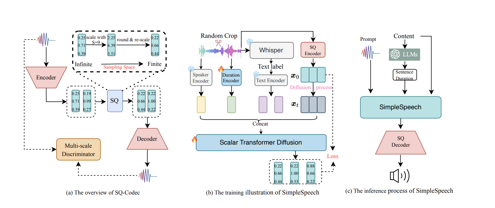

# <center> SimpleSpeech: Towards Simple and Efficient Speech Synthesis with Scalar Latent Transformer Diffusion Models </center>
<center> Dongchao Yang, Dingdong Wang, Haohan Guo, Xueyuan Chen, Xixin Wu, Helen Meng </center> 
<center> CUHK </center>
<center> Accepted by Interspeech 2024 </center> 
<center> Code is open-sourced in  https://github.com/yangdongchao/SimpleSpeech  </center>
 
 


## Introduction
In this study, we propose a simple and efficient Non-Autoregressive (NAR) text-to-speech (TTS) system based on diffusion, named SimpleSpeech. Its simpleness shows in three aspects: (1) SimlpeSpeech can be trained on the speech-only dataset, without any alignment information; (2) SimpleSpeech directly takes plain text as input and generates speech through an NAR way; (3) SimpleSpeech tries to model speech in a finite and compact latent space, which alleviates the modeling difficulty of diffusion. More specific, we propose a novel speech codec model (SQ-Codec) with scalar quantization, SQ-Codec effectively maps the complex speech signal into a finite and compact latent space, named as scalar latent space. Benefits from SQ-Codec, we apply a novel transformer diffusion model in the scalar latent space of SQ-Codec. We train SimpleSpeech on 4k hours of a speech-only dataset, SimpleSpeech shows natural prosody and voice cloning ability. Compared with previous large-scale TTS models \textit{e.g.} VALL-EX and Pheme TTS, SimpleSpeech presents significant speech quality and generation speed improvement while having a similar voice clone ability with less training data.

## Overview
The overview of SimpleSpeech as following picture shows.

In the following, we will show some generated samples by our proposed method. 

<style>
.audio-player {
  width: 200px;
}
.audio-player2 {
  width: 150px;
}
</style>

## Zero-shot TTS.
In the following, we first show some case in LibriTTS test clean set. We compare with VALL-EX, Pheme TTS and XTTS

| <center>  Content (The transcirption of the target audio) </center> | <center> Prompt </center> | <center> VALL-EX </center>| <center> Pheme TTS </center> | <center> XTTS </center> | <center> Ours </center> | <center> GT Speech </center>|
| -----------------------     |  -----------   | ------ | ----- |-------|
| You see, sir, these sharks are badly designed. | <audio class="audio-player2" src="prompt2/prompt_00.wav" controls preload></audio>   | <audio class="audio-player2" src="valle-x/prompt_00.wav" controls preload></audio> | <audio class="audio-player2" src="pheme/prompt_00.wav" controls preload></audio> | <audio class="audio-player2" src="xtts2/prompt_00.wav" controls preload></audio> | <audio class="audio-player2" src="ours/prompt_00.wav" controls preload></audio> | <audio class="audio-player2" src="gt/prompt_00.wav" controls preload></audio> |
| I cannot believe such was the case. | <audio class="audio-player2" src="prompt2/prompt_01.wav" controls preload></audio>   | <audio class="audio-player2" src="valle-x/prompt_01.wav" controls preload></audio> | <audio class="audio-player2" src="pheme/prompt_01.wav" controls preload></audio> | <audio class="audio-player2" src="xtts2/prompt_01.wav" controls preload></audio> | <audio class="audio-player2" src="ours/prompt_01.wav" controls preload></audio> | <audio class="audio-player2" src="gt/prompt_01.wav" controls preload></audio> |
| She felt the force of the objections. | <audio class="audio-player2" src="prompt2/prompt_02.wav" controls preload></audio>   | <audio class="audio-player2" src="valle-x/prompt_02.wav" controls preload></audio> | <audio class="audio-player2" src="pheme/prompt_02.wav" controls preload></audio> | <audio class="audio-player2" src="xtts2/prompt_02.wav" controls preload></audio> | <audio class="audio-player2" src="ours/prompt_02.wav" controls preload></audio> | <audio class="audio-player2" src="gt/prompt_02.wav" controls preload></audio> |
| She can't get it out of her head, even after fifty years. | <audio class="audio-player2" src="prompt2/prompt_03.wav" controls preload></audio>   | <audio class="audio-player2" src="valle-x/prompt_03.wav" controls preload></audio> | <audio class="audio-player2" src="pheme/prompt_03.wav" controls preload></audio> | <audio class="audio-player2" src="xtts2/prompt_03.wav" controls preload></audio> | <audio class="audio-player2" src="ours/prompt_03.wav" controls preload></audio> | <audio class="audio-player2" src="gt/prompt_03.wav" controls preload></audio> |
| And he had certainly neglected the Princess a little. | <audio class="audio-player2" src="prompt2/prompt_04.wav" controls preload></audio>   | <audio class="audio-player2" src="valle-x/prompt_04.wav" controls preload></audio> | <audio class="audio-player2" src="pheme/prompt_04.wav" controls preload></audio> | <audio class="audio-player2" src="xtts2/prompt_04.wav" controls preload></audio> | <audio class="audio-player2" src="ours/prompt_04.wav" controls preload></audio> | <audio class="audio-player2" src="gt/prompt_04.wav" controls preload></audio> |
| If we could only get him out of the way we might succeed better. | <audio class="audio-player2" src="prompt2/prompt_05.wav" controls preload></audio>   | <audio class="audio-player2" src="valle-x/prompt_05.wav" controls preload></audio> | <audio class="audio-player2" src="pheme/prompt_05.wav" controls preload></audio> | <audio class="audio-player2" src="xtts2/prompt_05.wav" controls preload></audio> | <audio class="audio-player2" src="ours/prompt_05.wav" controls preload></audio> | <audio class="audio-player2" src="gt/prompt_05.wav" controls preload></audio> |
| The sum required was offered with such delicacy that it could not be declined. | <audio class="audio-player2" src="prompt2/prompt_06.wav" controls preload></audio>   | <audio class="audio-player2" src="valle-x/prompt_06.wav" controls preload></audio> | <audio class="audio-player2" src="pheme/prompt_06.wav" controls preload></audio> | <audio class="audio-player2" src="xtts2/prompt_06.wav" controls preload></audio> | <audio class="audio-player2" src="ours/prompt_06.wav" controls preload></audio> | <audio class="audio-player2" src="gt/prompt_06.wav" controls preload></audio> |
| The ray from his lantern swung about the room for a moment, then he switched on the electric light. | <audio class="audio-player2" src="prompt2/prompt_19.wav" controls preload></audio>   | <audio class="audio-player2" src="valle-x/prompt_19.wav" controls preload></audio> | <audio class="audio-player2" src="pheme/prompt_19.wav" controls preload></audio> | <audio class="audio-player2" src="xtts2/prompt_19.wav" controls preload></audio> | <audio class="audio-player2" src="ours/prompt_19.wav" controls preload></audio> | <audio class="audio-player2" src="gt/prompt_19.wav" controls preload></audio> |
| I don't suppose any one else can find hidden worms that way | <audio class="audio-player2" src="prompt2/prompt_18.wav" controls preload></audio>   | <audio class="audio-player2" src="valle-x/prompt_18.wav" controls preload></audio> | <audio class="audio-player2" src="pheme/prompt_18.wav" controls preload></audio> | <audio class="audio-player2" src="xtts2/prompt_18.wav" controls preload></audio> | <audio class="audio-player2" src="ours/prompt_18.wav" controls preload></audio> | <audio class="audio-player2" src="gt/prompt_18.wav" controls preload></audio> |
| But at that moment the voice of the stranger was heard from the window | <audio class="audio-player2" src="prompt2/prompt_17.wav" controls preload></audio>   | <audio class="audio-player2" src="valle-x/prompt_17.wav" controls preload></audio> | <audio class="audio-player2" src="pheme/prompt_17.wav" controls preload></audio> | <audio class="audio-player2" src="xtts2/prompt_17.wav" controls preload></audio> | <audio class="audio-player2" src="ours/prompt_17.wav" controls preload></audio> | <audio class="audio-player2" src="gt/prompt_17.wav" controls preload></audio> |
| But the young man was there in presence; and John's will carried the day. | <audio class="audio-player2" src="prompt2/prompt_16.wav" controls preload></audio>   | <audio class="audio-player2" src="valle-x/prompt_16.wav" controls preload></audio> | <audio class="audio-player2" src="pheme/prompt_16.wav" controls preload></audio> | <audio class="audio-player2" src="xtts2/prompt_16.wav" controls preload></audio> | <audio class="audio-player2" src="ours/prompt_16.wav" controls preload></audio> | <audio class="audio-player2" src="gt/prompt_16.wav" controls preload></audio> |

## Compared with E3TTS.

| <center>  Content (The transcirption of the target audio) </center> | <center> Prompt </center> | <center> E3TTS </center>| <center> Ours </center> |
| -----------------------     |  -----------   | ------ | ----- |
| The small lamp in front of the icons was the only light left in the room. | <audio class="audio-player2" src="prompt2/prompt_15.wav" controls preload></audio>   | <audio class="audio-player2" src="e3tts/prompt_15.wav" controls preload></audio> | <audio class="audio-player2" src="ours/prompt_15.wav" controls preload></audio> |
| Come up on the bank and learn to perch, as we birds do. | <audio class="audio-player2" src="prompt2/prompt_14.wav" controls preload></audio>   | <audio class="audio-player2" src="e3tts/prompt_14.wav" controls preload></audio> | <audio class="audio-player2" src="ours/prompt_14.wav" controls preload></audio> |
| "I don't think so," replied Tom. | <audio class="audio-player2" src="prompt2/prompt_13.wav" controls preload></audio>   | <audio class="audio-player2" src="e3tts/prompt_13.wav" controls preload></audio> | <audio class="audio-player2" src="ours/prompt_13.wav" controls preload></audio> |
| "It's impossible," he said, "it's no good. | <audio class="audio-player2" src="prompt2/prompt_12.wav" controls preload></audio>   | <audio class="audio-player2" src="e3tts/prompt_12.wav" controls preload></audio> | <audio class="audio-player2" src="ours/prompt_12.wav" controls preload></audio> |
| They were glancing about with eager eyes. | <audio class="audio-player2" src="prompt2/prompt_10.wav" controls preload></audio>   | <audio class="audio-player2" src="e3tts/prompt_10.wav" controls preload></audio> | <audio class="audio-player2" src="ours/prompt_10.wav" controls preload></audio> |

## Compared with NaturalSpeech 2.

| <center>  Content (The transcirption of the target audio) </center> | <center> Prompt </center> | <center> NS2 </center>| <center> Ours </center> |
| -----------------------     |  -----------   | ------ | ----- |
| All the furniture belonged to other times | <audio class="audio-player2" src="compare_ns2/prompt/1_ref.wav" controls preload></audio>   | <audio class="audio-player2" src="compare_ns2/ns2/1_syn.wav" controls preload></audio> | <audio class="audio-player2" src="compare_ns2/ours/1_syn.wav" controls preload></audio> |
| Heaven, a good place to be raised. | <audio class="audio-player2" src="compare_ns2/prompt/2_ref.wav" controls preload></audio>   | <audio class="audio-player2" src="compare_ns2/ns2/2_syn.wav" controls preload></audio> | <audio class="audio-player2" src="compare_ns2/ours/2_syn.wav" controls preload></audio> |
| No thanks, I am glad to give you such easy happiness. | <audio class="audio-player2" src="compare_ns2/prompt/5_ref.wav" controls preload></audio>   | <audio class="audio-player2" src="compare_ns2/ns2/5_syn.wav" controls preload></audio> | <audio class="audio-player2" src="compare_ns2/ours/5_syn.wav" controls preload></audio> |
| Whatever appeal to her sense of beauty was straightway transferred to paper or canvas. | <audio class="audio-player2" src="compare_ns2/prompt/13_ref.wav" controls preload></audio>   | <audio class="audio-player2" src="compare_ns2/ns2/13_syn.wav" controls preload></audio> | <audio class="audio-player2" src="compare_ns2/ours/13_syn.wav" controls preload></audio> |
| John Wesley Kombash, Jacob Taylor, and Thomas Edward Skinner | <audio class="audio-player2" src="compare_ns2/prompt/11_ref.wav" controls preload></audio>   | <audio class="audio-player2" src="compare_ns2/ns2/11_syn.wav" controls preload></audio> | <audio class="audio-player2" src="compare_ns2/ours/11_syn.wav" controls preload></audio> |
| You will allow me to suggest, said he, that is a matter of opinion | <audio class="audio-player2" src="compare_ns2/prompt/35_ref.wav" controls preload></audio>   | <audio class="audio-player2" src="compare_ns2/ns2/35_syn.wav" controls preload></audio> | <audio class="audio-player2" src="compare_ns2/ours/35_syn.wav" controls preload></audio> |
| It is this that is of interest to theory of knowledge | <audio class="audio-player2" src="compare_ns2/prompt/33_ref.wav" controls preload></audio>   | <audio class="audio-player2" src="compare_ns2/ns2/33_syn.wav" controls preload></audio> | <audio class="audio-player2" src="compare_ns2/ours/33_syn.wav" controls preload></audio> |

## Compared with AudioBox.
We use the official model to generate speech from AudioBox https://audiobox.metademolab.com/maker. We use their defualt speaker to generate speech, thus please ignore the speaker timbre, and only focus on the speech quality.

| <center>  Content (The transcirption of the target audio) </center> | <center> AudioBox </center> | <center> Ours </center>|
| -----------------------     |  -----------   | ------ | ----- |
| In the following, I will give you a question and the corresponding emotion | <audio class="audio-player2" src="compare_audiobox/audiobox/audio_box1.wav" controls preload></audio>   | <audio class="audio-player2" src="compare_audiobox/ours/audiobox1.wav" controls preload></audio> |
| You are requested to provide a comforting response based on the emotion. | <audio class="audio-player2" src="compare_audiobox/audiobox/audio_box2.wav" controls preload></audio>   | <audio class="audio-player2" src="compare_audiobox/ours/audiobox2.wav" controls preload></audio> |
| with the goal of training models that help people solve problems that require real world interaction. | <audio class="audio-player2" src="compare_audiobox/audiobox/audio_box3.wav" controls preload></audio>   | <audio class="audio-player2" src="compare_audiobox/ours/audiobox3.wav" controls preload></audio> |


## Compared with UniAudio

| <center>  Content (The transcirption of the target audio) </center> | <center> Prompt </center> | <center> UniAudio </center>| <center> Ours </center> |
| -----------------------     |  -----------   | ------ | ----- |
| It is 16 years since John Berkson died. | <audio class="audio-player2" src="compare_uniaudio/prompt/tts_237-126133-0024.wav" controls preload></audio>   | <audio class="audio-player2" src="compare_uniaudio/audio/tts_237-134493-0000.wav" controls preload></audio> | <audio class="audio-player2" src="compare_uniaudio/ours/tts_237-134493-0000.wav" controls preload></audio> |
| That is one reason you are ojo the unlucky said the woman in sympathetic tone. | <audio class="audio-player2" src="compare_uniaudio/prompt/tts_1284-1180-0001.wav" controls preload></audio>   | <audio class="audio-player2" src="compare_uniaudio/audio/tts_1284-1180-0024.wav" controls preload></audio> | <audio class="audio-player2" src="compare_uniaudio/ours/tts_1284-1180-0024.wav" controls preload></audio> |

## Compared with NaturalSpeech 3

| <center>  Content (The transcirption of the target audio) </center> | <center> Prompt </center> | <center> NaturalSpeech 3 </center>| <center> Ours </center> |
| -----------------------     |  -----------   | ------ | ----- |
| It is this that is of interest to theory of knowledge. | <audio class="audio-player2" src="ns3/prompt/ns3_p1.wav" controls preload></audio>   | <audio class="audio-player2" src="ns3/ns/ns3_g1.wav" controls preload></audio> | <audio class="audio-player2" src="ns3/ours/g1.wav" controls preload></audio> |
| For, like as not, they must have thought him a prince when they saw his fine cap.| <audio class="audio-player2" src="ns3/prompt/ns3_p2.wav" controls preload></audio>   | <audio class="audio-player2" src="ns3/ns/ns3_g2.wav" controls preload></audio> | <audio class="audio-player2" src="ns3/ours/g2.wav" controls preload></audio> |
| They think you're proud because you've been away to school or something. | <audio class="audio-player2" src="ns3/prompt/ns3_p5.wav" controls preload></audio>   | <audio class="audio-player2" src="ns3/ns/ns3_g5.wav" controls preload></audio> | <audio class="audio-player2" src="ns3/ours/g5.wav" controls preload></audio> |
| For the past ten years, Conseil had gone with me wherever science beckoned. | <audio class="audio-player2" src="ns3/prompt/ns3_p6.wav" controls preload></audio>   | <audio class="audio-player2" src="ns3/ns/ns3_g6.wav" controls preload></audio> | <audio class="audio-player2" src="ns3/ours/g6.wav" controls preload></audio> |


## Audio Codec Reconstruction comparison

| Original Speech | <center> DAC </center> | <center> HiFi-Codec </center>| <center> Encodec </center> | <center> Ours </center> |
| -----------------------     |  -----------   | ------ | ----- |
| <audio class="audio-player2" src="codec/gt/p225_001.wav" controls preload></audio>   | <audio class="audio-player2" src="codec/dac/p225_001.wav" controls preload></audio> | <audio class="audio-player2" src="codec/hifi/p225_001.wav" controls preload></audio> |  <audio class="audio-player2" src="codec/encodec/p225_001.wav" controls preload></audio> |  <audio class="audio-player2" src="codec/ours/p225_001.wav" controls preload></audio> |
| <audio class="audio-player2" src="codec/gt/p225_002.wav" controls preload></audio>   | <audio class="audio-player2" src="codec/dac/p225_002.wav" controls preload></audio> | <audio class="audio-player2" src="codec/hifi/p225_002.wav" controls preload></audio> |  <audio class="audio-player2" src="codec/encodec/p225_002.wav" controls preload></audio> |  <audio class="audio-player2" src="codec/ours/p225_002.wav" controls preload></audio> |
| <audio class="audio-player2" src="codec/gt/p225_003.wav" controls preload></audio>   | <audio class="audio-player2" src="codec/dac/p225_003.wav" controls preload></audio> | <audio class="audio-player2" src="codec/hifi/p225_003.wav" controls preload></audio> |  <audio class="audio-player2" src="codec/encodec/p225_003.wav" controls preload></audio> |  <audio class="audio-player2" src="codec/ours/p225_003.wav" controls preload></audio> |
| <audio class="audio-player2" src="codec/gt/p225_004.wav" controls preload></audio>   | <audio class="audio-player2" src="codec/dac/p225_004.wav" controls preload></audio> | <audio class="audio-player2" src="codec/hifi/p225_004.wav" controls preload></audio> |  <audio class="audio-player2" src="codec/encodec/p225_004.wav" controls preload></audio> |  <audio class="audio-player2" src="codec/ours/p225_004.wav" controls preload></audio> |
| <audio class="audio-player2" src="codec/gt/p225_005.wav" controls preload></audio>   | <audio class="audio-player2" src="codec/dac/p225_005.wav" controls preload></audio> | <audio class="audio-player2" src="codec/hifi/p225_005.wav" controls preload></audio> |  <audio class="audio-player2" src="codec/encodec/p225_005.wav" controls preload></audio> |  <audio class="audio-player2" src="codec/ours/p225_005.wav" controls preload></audio> |

## Ablation study (Unet VS Transformer)

| <center>  Content (The transcirption of the target audio) </center> | <center> Unet </center> | <center> Transformer </center>|
| -----------------------     |  -----------   | ------ | ----- |
| You see, sir, these sharks are badly designed. | <audio class="audio-player2" src="ablation/unet/prompt_00.wav" controls preload></audio>   | <audio class="audio-player2" src="ablation/ours/prompt_00.wav" controls preload></audio> |
| I cannot believe such was the case. | <audio class="audio-player2" src="ablation/unet/prompt_01.wav" controls preload></audio>   | <audio class="audio-player2" src="ablation/ours/prompt_01.wav" controls preload></audio> |
| She felt the force of the objections. | <audio class="audio-player2" src="ablation/unet/prompt_02.wav" controls preload></audio>   | <audio class="audio-player2" src="ablation/ours/prompt_02.wav" controls preload></audio> |
| She can't get it out of her head, even after fifty years. | <audio class="audio-player2" src="ablation/unet/prompt_03.wav" controls preload></audio>   | <audio class="audio-player2" src="ablation/ours/prompt_03.wav" controls preload></audio> |


## Ablation study (Cross-attention condition vs In context condition)

| <center>  Content (The transcirption of the target audio) </center> | <center> Cross-attention </center> | <center> In context </center>|
| -----------------------     |  -----------   | ------ | ----- |
| You see, sir, these sharks are badly designed. | <audio class="audio-player2" src="ablation/cross/prompt_00.wav" controls preload></audio>   | <audio class="audio-player2" src="ablation/ours/prompt_00.wav" controls preload></audio> |
| I cannot believe such was the case. | <audio class="audio-player2" src="ablation/cross/prompt_01.wav" controls preload></audio>   | <audio class="audio-player2" src="ablation/ours/prompt_01.wav" controls preload></audio> |
| She felt the force of the objections. | <audio class="audio-player2" src="ablation/cross/prompt_02.wav" controls preload></audio>   | <audio class="audio-player2" src="ablation/ours/prompt_02.wav" controls preload></audio> |
| She can't get it out of her head, even after fifty years. | <audio class="audio-player2" src="ablation/cross/prompt_03.wav" controls preload></audio>   | <audio class="audio-player2" src="ablation/ours/prompt_03.wav" controls preload></audio> |


## Ablation study (VAE vs SQ)

| <center>  Content (The transcirption of the target audio) </center> | <center> VAE </center> | <center> SQ </center>|
| -----------------------     |  -----------   | ------ | ----- |
| If we could only get him out of the way we might succeed better. | <audio class="audio-player2" src="ablation/vae/prompt_05.wav" controls preload></audio>   | <audio class="audio-player2" src="ablation/ours/prompt_05.wav" controls preload></audio> |
| The sum required was offered with such delicacy that it could not be declined. | <audio class="audio-player2" src="ablation/vae/prompt_06.wav" controls preload></audio>   | <audio class="audio-player2" src="ablation/ours/prompt_06.wav" controls preload></audio> |
| That is the landslide which I predicted | <audio class="audio-player2" src="ablation/vae/prompt_08.wav" controls preload></audio>   | <audio class="audio-player2" src="ablation/ours/prompt_08.wav" controls preload></audio> |
| I want you to go out now, she said, I have no stamps. | <audio class="audio-player2" src="ablation/vae/prompt_09.wav" controls preload></audio>   | <audio class="audio-player2" src="ablation/ours/prompt_09.wav" controls preload></audio> |


## Ablation study (400h training data vs 4000h training data)

| <center>  Content (The transcirption of the target audio) </center> | <center> 400h </center> | <center> 4000h </center>|
| -----------------------     |  -----------   | ------ | ----- |
| You see, sir, these sharks are badly designed. | <audio class="audio-player2" src="ablation/small/prompt_00.wav" controls preload></audio>   | <audio class="audio-player2" src="ablation/ours/prompt_00.wav" controls preload></audio> |
| I cannot believe such was the case. | <audio class="audio-player2" src="ablation/small/prompt_01.wav" controls preload></audio>   | <audio class="audio-player2" src="ablation/ours/prompt_01.wav" controls preload></audio> |
| She felt the force of the objections. | <audio class="audio-player2" src="ablation/small/prompt_02.wav" controls preload></audio>   | <audio class="audio-player2" src="ablation/ours/prompt_02.wav" controls preload></audio> |
| She can't get it out of her head, even after fifty years. | <audio class="audio-player2" src="ablation/small/prompt_03.wav" controls preload></audio>   | <audio class="audio-player2" src="ablation/ours/prompt_03.wav" controls preload></audio> |


## Conclusion

In this work, we try to answer the question whether researchers from the academic community can rapidly develop a large TTS model using a few GPUs and limited data resources. Our study demonstrates the feasibility of constructing a simple and efficient TTS model. The proposed SQ-Codec is straightforward to train, requiring no special techniques. Similarly, the scalar latent diffusion model can be easily developed and trained, leveraging the LLM structure and diffusion training strategy.

Research into large TTS models began with Tortoise TTS and VALL-E last year. After one year, numerous related works have demonstrated impressive performance. Our findings indicate that: (1) a high-quality tokenizer is fundamental for generating high-quality speech; (2) speaker timbre disentanglement is crucial for enhancing voice cloning capabilities, potentially improving similarity scores. Given that we can easily access advanced model structures from GitHub, data quality and the number of GPUs emerge as the third critical factor for the success of large TTS models.

## Limitations

Although SimpleSpeech demonstrates the ability to clone voices, we do not scale the training data due to GPU resource limitations. Furthermore, we have not designed speaker disentanglement in the Codec model to enhance voice cloning capabilities. Regarding limited comparisons: (1) We have not compared all related large TTS models because not all models are openly available. We respect all previous works, even though some are not mentioned in our paper due to space constraints. Additionally, we do not claim that SimpleSpeech is superior to any previous models. (2) The evaluation is not comprehensive; we only conducted Mean Opinion Score (MOS) and Subjective Mean Opinion Score (SMOS) evaluations. More extensive evaluations are necessary to assess prosody and naturalness accurately.

## The prompt for ChatGPT

A simple sampe to use the in-context-learning of GPT to estimate the duration of text.

```
completion = openai.ChatCompletion.create(
          messages=[
                  {
                      'role': 'user',
                      'content':f' I want to predict that the duration of speech based on the content and you need to give me the results in the following format:\
                      Question: Three members of this shift separately took this opportunity to visit the Cellar Coffee House.\
                      Answer: It includes 15 words, it may cost 5 to 6 seconds.\
                      Question: This Allotment Division will consider all of the recommendations submitted to it. \
                      Answer: It includes 12 words, it may cost 4 to 5 seconds. \
                      Question: has been far less than in any previous, comparable period. \
                      Answer: It includes 10 words, it may cost 3 to 4 seconds. \
                      Question: They were glancing about with eager eyes. \
                      Answer: It includes 7 words, it may cost 2 to 3 seconds. \
                      Question: I do not think so. \
                      Answer: It includes 5 words, it may cost 1 to 2 seconds. \
                      You should consider the pronunciation of each word. Some words may need more time to pronunciate. In general, if a word includes more letter, it costs more time to read.  \
                      In summary, you should know how many words in the sentence, then consider how long it will cost to read it.\
                      Question: {caption} \
                      Answer:',
                  },
              ]
          )
```
